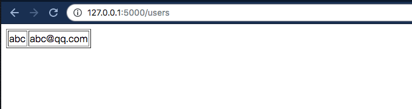

# flask-mysql-demo
> set up a demo for flask 、mysql with Mac OS 

### 01.Set up mysql (docker)

pull docker mysql images

`docker pull mysql:5.6.45`

start docker container,and set root password *password* 

`docker run --name flask-mysql-demo1 -e MYSQL_ROOT_PASSWORD=password -p 3306:3306 -d mysql:5.6.45`

test the mysql service

```bash
➜docker exec -it flask-mysql-demo1 bash
root@9b6b3dafbaab:/# mysql -uroot -p
Enter password:
Welcome to the MySQL monitor.  Commands end with ; or \g.
Your MySQL connection id is 1
Server version: 5.6.45 MySQL Community Server (GPL)

Copyright (c) 2000, 2019, Oracle and/or its affiliates. All rights reserved.

Oracle is a registered trademark of Oracle Corporation and/or its
affiliates. Other names may be trademarks of their respective
owners.

Type 'help;' or '\h' for help. Type '\c' to clear the current input statement.

mysql> show databases;
+--------------------+
| Database           |
+--------------------+
| information_schema |
| mysql              |
| performance_schema |
+--------------------+
```

set up a database and table,named **flaskapp**、**users**
```bash
mysql> CREATE DATABASE flaskapp;
Query OK, 1 row affected (0.00 sec)

mysql> USE flaskapp;
Database changed
mysql> CREATE TABLE users(name varchar(20),email varchar(40));
Query OK, 0 rows affected (0.01 sec)

mysql> SELECT * FROM users;
Empty set (0.00 sec)
```

###  02.Set up Virtual Env and run app.py

clone the project to your local path

`git clone https://github.com/qinrui777/flask-mysql-demo.git && cd flask-mysql-demo.git `

create a virtual env ,named *venv*  

`virtualenv venv`

activate virtual env

`source venv/bin/activate`

install dependency from requirements.txt

`(venv) ➜  flask-mysql-demo git:(master)  pip install -r requirements.txt`

start application  

`(venv) ➜  flask-mysql-demo git:(master) ✗ python app.py`


**The application runs on  `localhost:5000`**





### 03. check data on database 

```bash
mysql> select * from users;
+------+------------------+
| name | email            |
+------+------------------+
| 11   | 7xxx3601@qq.com |
| 12   | x7773601@qq.com |
+------+------------------+
2 rows in set (0.00 sec)
```


Ref: 
- https://github.com/febin-george/flaskapp